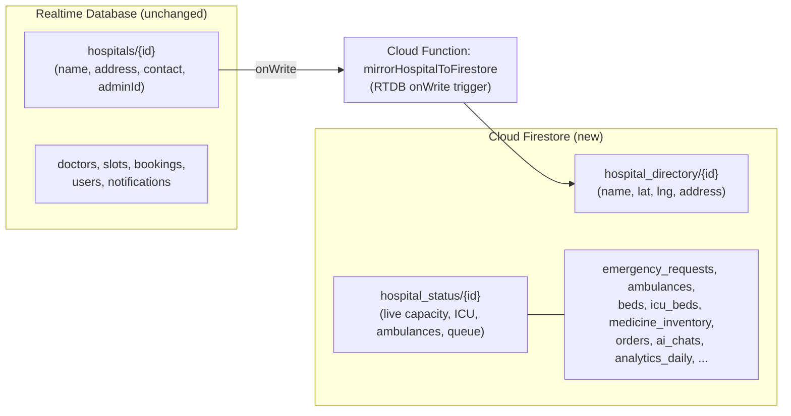
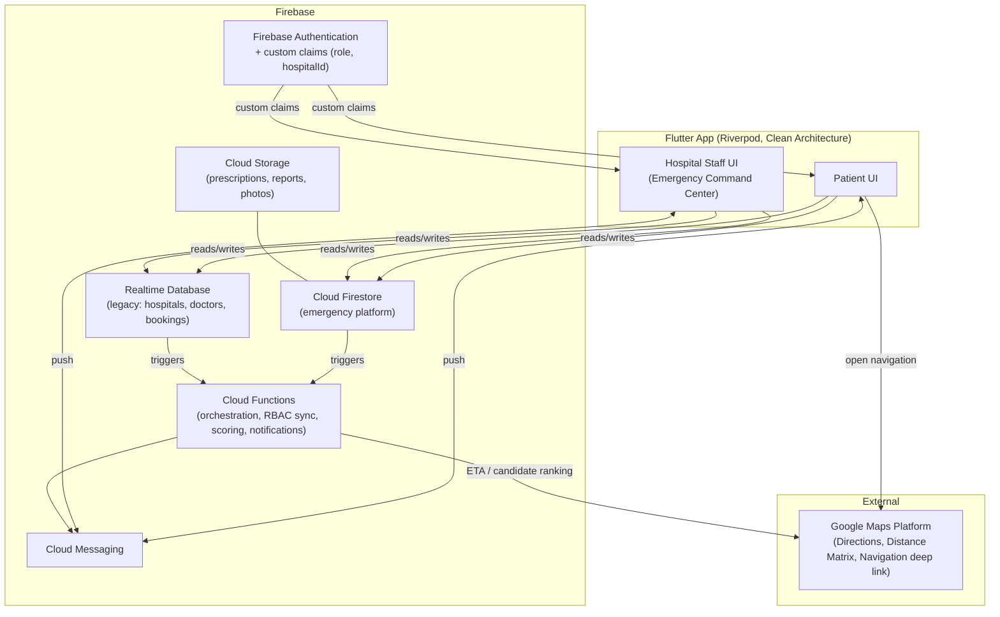
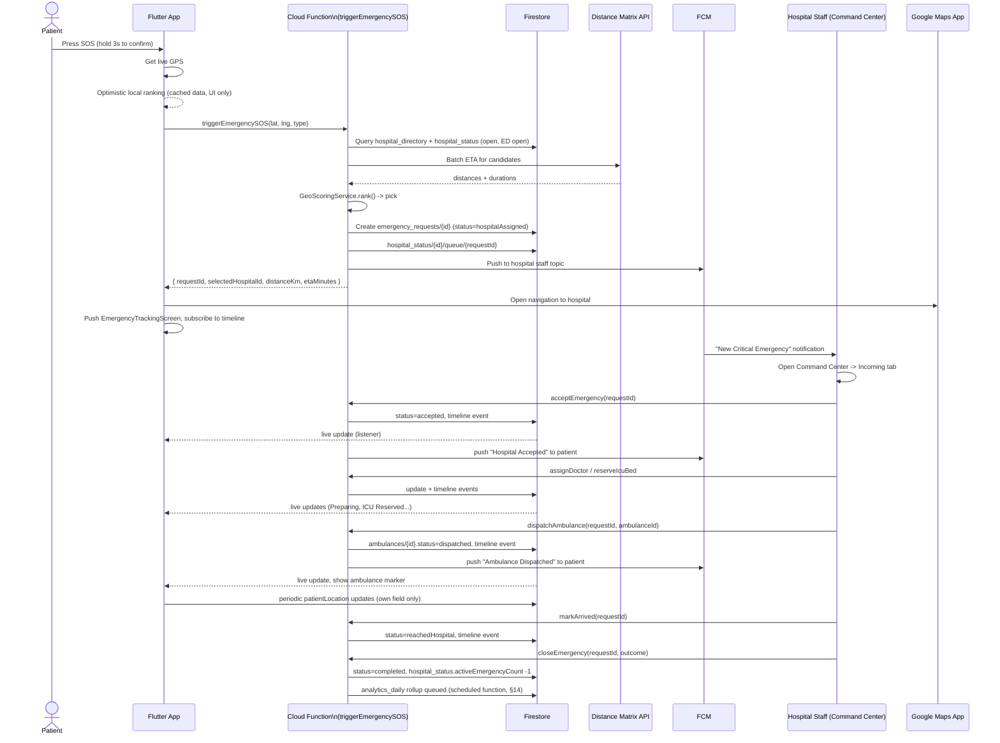
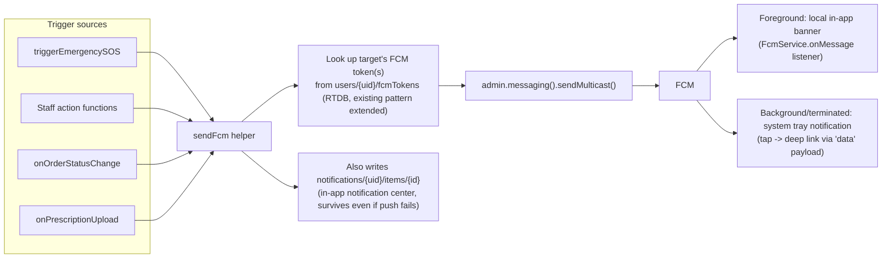

# MediLink Emergency Response Platform — Architecture

Status: **Design document** (approved scope: hybrid data layer, full-architecture-first, AI provider deferred).
This is the source of truth for implementing Features 1, 3, 5, 6, 7, 10 and the Smart Hospital Emergency Flow.
Each feature below gets built out with production code in its own follow-up session, in the order defined in §22.

---

## 0. Decisions this document assumes

| Decision | Choice | Why |
|---|---|---|
| Data layer | **Hybrid** | Existing features (`auth`, `hospitals`, `doctors`, `bookings`, `slots`, `notifications`) stay on Realtime Database exactly as they are today — zero risk to what already works. All *new* emergency-platform features are built on **Cloud Firestore**, because they need compound queries, geo-range candidate selection, subcollections for timelines/messages, and transactional writes that RTDB does the wrong way. |
| Deliverable | Architecture first | This doc covers schema, rules, diagrams, folder structure, provider/repo contracts, screen list, and build order for everything. Full production code ships feature-by-feature afterward. |
| AI Assistant | Design-only | Firestore schema, conversation model, prompt architecture, and safety layer are specified now behind a provider-agnostic interface. No live LLM calls are wired up yet. |

### Why hybrid isn't a permanent mess

The two databases don't overlap on live-changing data — they're joined on `hospitalId` only:

- **RTDB stays authoritative for hospital *identity*** (name, address, contact, adminId, photoUrl) — this is what `HospitalRepository` already owns, untouched.
- **Firestore owns everything that changes fast or needs querying**: emergency requests, live capacity, ambulances, beds, ICU, pharmacy, analytics.
- A new Cloud Function mirrors the *minimal geo-relevant fields* (name, lat, lng, address) from RTDB into a Firestore collection called `hospital_directory` whenever a hospital is created/updated/deleted in RTDB. This is the only sync point, it's one-directional (RTDB → Firestore), and it means the hot path (an emergency SOS press) never has to cross databases — it reads Firestore only.



---

## 1. High-Level Architecture



---

## 2. Clean Architecture Folder Structure

New features get a proper 3-layer Clean Architecture split. Existing `features/auth` and `features/home` are **not** restructured (out of scope — see hybrid decision). New folders:

```
lib/
├── core/
│   ├── error/
│   │   ├── failures.dart              # sealed Failure classes (NetworkFailure, PermissionFailure, NotFoundFailure...)
│   │   └── exceptions.dart            # thrown at datasource layer, mapped to Failure at repository layer
│   ├── network/
│   │   └── network_info.dart          # connectivity check, used for offline gating
│   ├── firestore/
│   │   ├── firestore_paths.dart       # single source of truth for every collection path/name
│   │   └── firestore_converters.dart  # withConverter<T> generics helper
│   ├── services/
│   │   ├── fcm_service.dart           # token registration, foreground/background handlers, topic subs
│   │   ├── maps_service.dart          # Directions API, Distance Matrix API, navigation deep link
│   │   ├── geo_scoring_service.dart   # pure Hospital Suitability Score function (shared client/Cloud Function logic, ported to TS for CF)
│   │   ├── rbac_service.dart          # reads custom claims, exposes AppRole, forces token refresh after role change
│   │   └── storage_service.dart       # Cloud Storage upload/download (prescriptions, reports)
│   └── theme/ ...                     # unchanged
│
├── features/
│   ├── emergency/                     # FEATURE 1 + core of the Smart Emergency Flow
│   │   ├── domain/
│   │   │   ├── entities/ (emergency_request.dart, emergency_timeline_event.dart, hospital_candidate.dart)
│   │   │   ├── repositories/ (emergency_repository.dart — abstract)
│   │   │   └── usecases/ (trigger_sos_usecase.dart, watch_emergency_status_usecase.dart, cancel_emergency_usecase.dart)
│   │   ├── data/
│   │   │   ├── models/ (emergency_request_model.dart, timeline_event_model.dart — fromFirestore/toFirestore)
│   │   │   ├── datasources/ (emergency_remote_datasource.dart — Firestore + Callable Function, emergency_local_datasource.dart — Hive cache of last known state for offline)
│   │   │   └── repositories/ (emergency_repository_impl.dart)
│   │   └── presentation/
│   │       ├── providers/ (emergency_providers.dart)
│   │       ├── screens/ (sos_confirm_screen.dart, emergency_tracking_screen.dart)
│   │       └── widgets/ (sos_button.dart, emergency_status_timeline.dart)
│   │
│   ├── command_center/                # FEATURE 3 (hospital-side, separate from appointments)
│   │   ├── domain/ (entities: incoming_emergency.dart, hospital_status.dart; repositories; usecases: accept, reject, assign_doctor, assign_ambulance, reserve_icu, reserve_ot, mark_arrived, close_emergency)
│   │   ├── data/ (models, datasources, repositories)
│   │   └── presentation/
│   │       ├── screens/ (command_center_dashboard.dart, emergency_detail_screen.dart, emergency_map_view_screen.dart, emergency_history_screen.dart)
│   │       └── widgets/ (emergency_priority_badge.dart, incoming_emergency_card.dart)
│   │
│   ├── ambulance/                     # FEATURE 6
│   │   ├── domain/ ...  entities: ambulance.dart, ambulance_trip.dart
│   │   ├── data/ ...
│   │   └── presentation/ (screens: ambulance_management_screen.dart, ambulance_tracking_screen.dart (patient-facing))
│   │
│   ├── pharmacy/                      # FEATURE 7
│   │   ├── domain/ ... entities: medicine.dart, prescription.dart, pharmacy_order.dart
│   │   ├── data/ ...
│   │   └── presentation/ (screens: medicine_search_screen.dart, prescription_upload_screen.dart, order_tracking_screen.dart, pharmacy_inventory_screen.dart (hospital side))
│   │
│   ├── ai_assistant/                  # FEATURE 5
│   │   ├── domain/ ... entities: chat_session.dart, chat_message.dart
│   │   ├── data/ ... datasources/ai_provider_datasource.dart (interface — see §11)
│   │   └── presentation/ (screens: ai_assistant_screen.dart, symptom_checker_screen.dart)
│   │
│   └── analytics/                     # FEATURE 10 (hospital admin only)
│       ├── domain/ ... entities: daily_analytics_snapshot.dart
│       ├── data/ ...
│       └── presentation/ (screens: analytics_dashboard_screen.dart, widgets: kpi_tile, trend_chart, heatmap)
│
functions/                             # Cloud Functions (TypeScript)
├── src/
│   ├── emergency/ (triggerEmergencySOS.ts, onEmergencyStatusChange.ts, mirrorHospitalToFirestore.ts)
│   ├── ambulance/ (onAmbulanceDispatch.ts)
│   ├── pharmacy/ (onOrderStatusChange.ts, onPrescriptionUpload.ts)
│   ├── notifications/ (sendFcm.ts — shared helper)
│   ├── analytics/ (aggregateDailyAnalytics.ts — scheduled)
│   ├── rbac/ (onUserRoleWrite.ts — sets custom claims)
│   └── index.ts
```

Rule of thumb applied throughout: **`domain` has zero Firebase imports.** Firestore/FCM/Maps types never leak past `data/`. This is what makes it possible to unit-test use cases and later swap Firestore for something else without touching UI or business logic.

---

## 3. Role-Based Access Control — foundation for everything else

Today, role is computed client-side from email domain (`@hospital.com` → admin). That's fine for the two roles the existing app has, but it **cannot** express Doctor / Ambulance Driver / Pharmacy / Emergency Staff, and — more importantly — **Firestore security rules must not trust a role the client claims**. We need a server-verified role.

**New Firestore collection: `user_roles/{uid}`**

| Field | Type | Notes |
|---|---|---|
| `uid` | string | doc ID = uid |
| `role` | string enum | `patient` \| `hospital_admin` \| `doctor` \| `ambulance_driver` \| `pharmacy` \| `emergency_staff` |
| `hospitalId` | string? | null for `patient`; required for all staff roles |
| `employeeId` | string? | staff badge/ID, optional |
| `permissions` | array\<string\> | fine-grained overrides, e.g. `["assign_icu", "dispatch_ambulance"]` — optional, role implies defaults |
| `createdAt` / `updatedAt` | timestamp | |
| `isActive` | bool | staff off-boarding sets this false instead of deleting |

**Cloud Function `onUserRoleWrite`** (Firestore `onWrite` trigger on `user_roles/{uid}`):
```ts
export const onUserRoleWrite = functions.firestore
  .document('user_roles/{uid}')
  .onWrite(async (change, context) => {
    const uid = context.params.uid;
    const after = change.after.data();
    if (!after || after.isActive === false) {
      await admin.auth().setCustomUserClaims(uid, null);
      return;
    }
    await admin.auth().setCustomUserClaims(uid, {
      role: after.role,
      hospitalId: after.hospitalId ?? null,
    });
  });
```

Client side, after any role assignment (e.g. an admin adds a doctor as staff), the affected user must call `FirebaseAuth.instance.currentUser.getIdTokenResult(true)` (force refresh) before the new claims take effect — `RbacService.refreshClaims()` wraps this.

- **Patient role default**: on first sign-up, a Cloud Function (`onCreate` Auth trigger) writes `user_roles/{uid} = { role: 'patient' }` automatically — patients never need manual role assignment.
- **Hospital staff roles**: assigned by a `hospital_admin` from the Command Center's "Manage Staff" screen (writes to `user_roles`), which requires the assigning admin's own claim to be `hospital_admin` for that `hospitalId` — enforced in rules (§6).

All Firestore rules below reference `request.auth.token.role` and `request.auth.token.hospitalId`, which are only trustworthy because of this sync function.

---

## 4. Firestore Database Design

Naming convention: snake_case collection names, camelCase fields, `serverTimestamp()` for all time fields written by clients (never trust client clocks for ordering).

### 4.1 `hospital_directory/{hospitalId}`
Mirror of RTDB hospital identity, geo-queryable. Doc ID **must equal** the RTDB hospital push ID.

| Field | Type |
|---|---|
| `hospitalId` | string (= RTDB id) |
| `name`, `address` | string |
| `location` | `GeoPoint` |
| `geohash` | string (for range queries, see §4.notes) |
| `syncedAt` | timestamp |

### 4.2 `hospital_status/{hospitalId}`
The live operational state used by scoring and by the Command Center. One doc per hospital, updated in place (not appended).

| Field | Type | Notes |
|---|---|---|
| `hospitalId` | string | |
| `isOpen` | bool | hospital open at all |
| `emergencyDeptOpen` | bool | hard filter for SOS eligibility |
| `icuBedsTotal`, `icuBedsAvailable` | int | |
| `generalBedsTotal`, `generalBedsAvailable` | int | |
| `otRoomsTotal`, `otRoomsAvailable` | int | |
| `emergencyDoctorsOnDuty`, `emergencyDoctorsAvailable` | int | |
| `ambulancesTotal`, `ambulancesAvailable` | int | denormalized count, source of truth is `ambulances` collection |
| `activeEmergencyCount` | int | current queue/load, denormalized counter |
| `avgTreatmentMinutes` | number | rolling average, feeds analytics + ETA estimates |
| `updatedAt` | timestamp | |
| `updatedBy` | string (uid) | |

Updated by: Command Center staff actions (manual bed/ICU/doctor updates), and by Cloud Functions whenever an emergency changes state (increment/decrement `activeEmergencyCount`, decrement `icuBedsAvailable` on ICU reservation, decrement `ambulancesAvailable` on dispatch).

### 4.3 `emergency_requests/{requestId}`

| Field | Type | Notes |
|---|---|---|
| `patientUid` | string | |
| `patientSnapshot` | map | denormalized: `name, age, bloodGroup, phoneNumber, medicalConditions[], emergencyContact{name,phone}` — captured at creation time so hospital sees it even if profile later changes |
| `status` | string enum | see §10 status list |
| `priority` | string enum | `critical` \| `high` \| `medium` \| `low` |
| `emergencyType` | string | e.g. `cardiac`, `accident`, `breathing`, `unspecified` (patient-selected or default) |
| `patientLocation` | `GeoPoint` | last known, updated live during transit |
| `patientLocationUpdatedAt` | timestamp | |
| `selectedHospitalId` | string | winner of the suitability score |
| `hospitalCandidates` | array\<map\> | top-N candidates + scores, kept for audit/debugging (`{hospitalId, score, distanceKm, etaMinutes}`) |
| `distanceKm`, `etaMinutes` | number | to selected hospital, computed at creation |
| `assignedDoctorId` | string? | set on accept |
| `assignedAmbulanceId` | string? | set on dispatch |
| `reservedIcuBedId` | string? | |
| `reservedOtId` | string? | |
| `staffInstructions` | array\<map\> | `{text, sentBy, sentAt}` — free-text notes hospital sends to patient |
| `createdAt`, `updatedAt` | timestamp | |
| `acceptedAt`, `arrivedAt`, `completedAt`, `cancelledAt` | timestamp? | |
| `cancelReason` / `rejectReason` | string? | |

**Subcollection** `emergency_requests/{requestId}/timeline/{eventId}` — append-only audit trail, one doc per status transition:

| Field | Type |
|---|---|
| `status` | string enum |
| `label` | string (human-readable, e.g. "Ambulance Dispatched") |
| `actorUid` | string? (null for system-generated events) |
| `actorRole` | string? |
| `metadata` | map (e.g. `{ambulanceId, doctorName}`) |
| `timestamp` | timestamp |

This subcollection is what the patient's live tracking screen listens to (`.orderBy('timestamp')` snapshot listener) — it's the direct data source for the "Hospital Accepted → Preparing → Ambulance Dispatched → Hospital Ready → Reached Hospital → Treatment Started" UI.

### 4.4 `emergency_queue/{hospitalId}` (subcollection, not a top-level collection)
`hospital_status/{hospitalId}/queue/{requestId}` — a lightweight pointer doc (`{requestId, priority, createdAt}`) the Command Center's "Incoming Requests" list listens to, so it doesn't need a compound query across all of `emergency_requests`. Deleted when the emergency leaves `pending`/`accepted` state.

### 4.5 `ambulances/{ambulanceId}`

| Field | Type |
|---|---|
| `hospitalId` | string |
| `vehicleNumber` | string |
| `driverUid` | string? |
| `driverName`, `driverPhone` | string |
| `status` | enum: `available` \| `dispatched` \| `en_route_to_patient` \| `en_route_to_hospital` \| `maintenance` \| `offline` |
| `currentLocation` | `GeoPoint` |
| `currentLocationUpdatedAt` | timestamp |
| `activeTripId` | string? (→ `ambulance_trips`) |
| `createdAt` | timestamp |

**Subcollection** `ambulances/{ambulanceId}/trips/{tripId}` (also mirrored at top level `ambulance_trips/{tripId}` for the patient's tracking query by `emergencyRequestId`):

| Field | Type |
|---|---|
| `emergencyRequestId` | string |
| `hospitalId`, `ambulanceId` | string |
| `status` | `dispatched` \| `arrived_at_patient` \| `transporting` \| `arrived_at_hospital` \| `completed` |
| `dispatchedAt`, `patientPickedUpAt`, `completedAt` | timestamp? |
| `etaMinutes` | number |

### 4.6 `beds/{hospitalId}/records/{bedId}` and `icu_beds/{hospitalId}/records/{bedId}`
Per-bed granularity (for ward management beyond the aggregate counts in `hospital_status`):

| Field | Type |
|---|---|
| `bedNumber` | string |
| `ward` | string |
| `status` | `available` \| `occupied` \| `reserved` \| `cleaning` |
| `reservedForRequestId` | string? |
| `patientUid` | string? |
| `updatedAt` | timestamp |

### 4.7 `operation_theatres/{hospitalId}/records/{otId}`
Same shape as beds: `otNumber`, `status` (`available`/`in_use`/`reserved`/`cleaning`), `reservedForRequestId`, `updatedAt`.

### 4.8 `medicine_inventory/{hospitalId}/items/{medicineId}`

| Field | Type |
|---|---|
| `name`, `genericName`, `manufacturer` | string |
| `category` | string |
| `unitPrice` | number |
| `stockQuantity` | int |
| `requiresPrescription` | bool |
| `isActive` | bool |
| `updatedAt` | timestamp |

### 4.9 `prescriptions/{prescriptionId}`

| Field | Type |
|---|---|
| `patientUid` | string |
| `hospitalId` | string? (target pharmacy) |
| `imageUrl` | string (Cloud Storage path) |
| `status` | `pending_review` \| `approved` \| `rejected` |
| `reviewedBy` | string (uid)? |
| `reviewNote` | string? |
| `createdAt`, `reviewedAt` | timestamp |

### 4.10 `orders/{orderId}`

| Field | Type |
|---|---|
| `patientUid`, `hospitalId` | string |
| `prescriptionId` | string? |
| `items` | array\<map\> `{medicineId, name, quantity, unitPrice}` |
| `totalAmount` | number |
| `status` | `placed` \| `confirmed` \| `preparing` \| `out_for_delivery` \| `delivered` \| `cancelled` |
| `deliveryAddress` | string |
| `createdAt`, `updatedAt` | timestamp |

**Subcollection** `orders/{orderId}/tracking/{eventId}` — same append-only timeline pattern as emergencies: `{status, note, timestamp}`.

### 4.11 `medical_reports/{reportId}`

| Field | Type |
|---|---|
| `patientUid` | string |
| `fileUrl` | string (Cloud Storage) |
| `fileType` | `pdf` \| `image` |
| `aiSummary` | string? (populated once AI explanation feature is live) |
| `uploadedAt` | timestamp |

### 4.12 `ai_chats/{chatId}` + subcollection `ai_chats/{chatId}/messages/{messageId}`
See §11 for full detail. Summary: `chatId` per conversation session, `messages` subcollection holds `{role: 'user'|'assistant'|'system', content, createdAt, metadata}`.

### 4.13 `analytics_daily/{hospitalId}_{yyyy-mm-dd}`
One doc per hospital per day, written by a scheduled Cloud Function (§14). Not written directly by clients.

| Field | Type |
|---|---|
| `hospitalId`, `date` | string |
| `patientsCount`, `emergencyCasesCount`, `appointmentsCount` | int |
| `doctorUtilizationPct` | number |
| `bedOccupancyPct`, `icuOccupancyPct` | number |
| `revenueTotal`, `medicineSalesTotal` | number |
| `ambulanceTripsCount` | int |
| `avgWaitingMinutes` | number |
| `patientSatisfactionAvg` | number? |

### 4.14 `notifications/{uid}/items/{notificationId}` (Firestore-side, separate from the existing RTDB `notifications` used by the appointments feature)

| Field | Type |
|---|---|
| `type` | `emergency` \| `ambulance` \| `pharmacy` \| `system` |
| `title`, `body` | string |
| `data` | map (deep-link payload, e.g. `{requestId}`) |
| `isRead` | bool |
| `createdAt` | timestamp |

### Notes on geoqueries
Firestore has no native radius query. Approach: store `geohash` (via the `dart_geohash` package) on `hospital_directory`, query a geohash bounding-box range (`where('geohash', '>=', lower).where('geohash', '<=', upper)`) to get *candidates*, then compute exact Haversine distance client/function-side to filter to true radius and rank. Given hospital counts are realistically in the hundreds per region (not millions), a simpler, equally valid v1 approach — and what's recommended for launch — is: fetch **all** `hospital_directory` docs where the joined `hospital_status.isOpen == true`, compute distance for all of them in the Cloud Function (cheap at this scale), and skip geohashing entirely. Geohashing becomes worth the complexity if the directory grows past a few thousand hospitals; noted here so it's a deliberate, revisitable decision, not an oversight.

---

## 5. ER Diagram

```mermaid
erDiagram
    USER_ROLES ||--o{ EMERGENCY_REQUESTS : "creates (patient)"
    HOSPITAL_DIRECTORY ||--|| HOSPITAL_STATUS : "1:1 live state"
    HOSPITAL_DIRECTORY ||--o{ EMERGENCY_REQUESTS : "selected for"
    EMERGENCY_REQUESTS ||--o{ EMERGENCY_TIMELINE : "has events"
    EMERGENCY_REQUESTS ||--o| AMBULANCE_TRIPS : "may dispatch"
    HOSPITAL_DIRECTORY ||--o{ AMBULANCES : owns
    AMBULANCES ||--o{ AMBULANCE_TRIPS : performs
    HOSPITAL_DIRECTORY ||--o{ BEDS : owns
    HOSPITAL_DIRECTORY ||--o{ ICU_BEDS : owns
    HOSPITAL_DIRECTORY ||--o{ OPERATION_THEATRES : owns
    HOSPITAL_DIRECTORY ||--o{ MEDICINE_INVENTORY : stocks
    USER_ROLES ||--o{ PRESCRIPTIONS : uploads
    USER_ROLES ||--o{ ORDERS : places
    ORDERS ||--o{ ORDER_TRACKING : "has events"
    PRESCRIPTIONS ||--o| ORDERS : "fulfills into"
    USER_ROLES ||--o{ MEDICAL_REPORTS : owns
    USER_ROLES ||--o{ AI_CHATS : has
    AI_CHATS ||--o{ AI_CHAT_MESSAGES : contains
    HOSPITAL_DIRECTORY ||--o{ ANALYTICS_DAILY : "rolled up per day"
    USER_ROLES ||--o{ NOTIFICATIONS : receives

    USER_ROLES {
        string uid PK
        string role
        string hospitalId FK
    }
    HOSPITAL_DIRECTORY {
        string hospitalId PK
        geopoint location
    }
    HOSPITAL_STATUS {
        string hospitalId PK_FK
        int icuBedsAvailable
        int ambulancesAvailable
        int activeEmergencyCount
    }
    EMERGENCY_REQUESTS {
        string requestId PK
        string patientUid FK
        string selectedHospitalId FK
        string status
        string priority
    }
    EMERGENCY_TIMELINE {
        string eventId PK
        string requestId FK
        string status
        timestamp timestamp
    }
    AMBULANCES {
        string ambulanceId PK
        string hospitalId FK
        string status
    }
    AMBULANCE_TRIPS {
        string tripId PK
        string ambulanceId FK
        string emergencyRequestId FK
    }
```

---

## 6. Security Rules (`firestore.rules`)

```js
rules_version = '2';
service cloud.firestore {
  match /databases/{database}/documents {

    // ---------- helpers ----------
    function isSignedIn() { return request.auth != null; }
    function role() { return request.auth.token.role; }
    function myHospitalId() { return request.auth.token.hospitalId; }
    function isPatient() { return isSignedIn() && role() == 'patient'; }
    function isHospitalAdmin() { return isSignedIn() && role() == 'hospital_admin'; }
    function isDoctor() { return isSignedIn() && role() == 'doctor'; }
    function isAmbulanceDriver() { return isSignedIn() && role() == 'ambulance_driver'; }
    function isPharmacy() { return isSignedIn() && role() == 'pharmacy'; }
    function isEmergencyStaff() { return isSignedIn() && role() == 'emergency_staff'; }
    function isHospitalStaff() {
      return isHospitalAdmin() || isDoctor() || isAmbulanceDriver() || isPharmacy() || isEmergencyStaff();
    }
    function belongsToHospital(hospitalId) {
      return isHospitalStaff() && myHospitalId() == hospitalId;
    }
    function isOwner(uid) { return isSignedIn() && request.auth.uid == uid; }

    // ---------- RBAC source ----------
    match /user_roles/{uid} {
      allow read: if isOwner(uid) || isHospitalAdmin();
      // only a hospital_admin may write staff roles for THEIR hospital; a user can never self-assign a staff role
      allow create, update: if isHospitalAdmin() && request.resource.data.hospitalId == myHospitalId()
                              && request.resource.data.role in ['doctor','ambulance_driver','pharmacy','emergency_staff'];
      allow write: if false; // patient bootstrap doc is written only by the onCreate Cloud Function (Admin SDK bypasses rules)
    }

    // ---------- hospital directory / status ----------
    match /hospital_directory/{hospitalId} {
      allow read: if isSignedIn();
      allow write: if false; // Cloud Function only (Admin SDK)
    }
    match /hospital_status/{hospitalId} {
      allow read: if isSignedIn();
      allow update: if belongsToHospital(hospitalId);
      allow create, delete: if false; // Cloud Function only
    }

    // ---------- emergency requests ----------
    match /emergency_requests/{requestId} {
      allow read: if isSignedIn() && (
                     resource.data.patientUid == request.auth.uid ||
                     belongsToHospital(resource.data.selectedHospitalId)
                   );
      allow create: if false; // only the triggerEmergencySOS Callable Function creates these
      allow update: if belongsToHospital(resource.data.selectedHospitalId)
                     && request.resource.data.patientUid == resource.data.patientUid; // staff can't reassign owner
      // patient may update ONLY their own live location field while the request is active
      allow update: if isOwner(resource.data.patientUid)
                     && request.resource.data.diff(resource.data).affectedKeys()
                          .hasOnly(['patientLocation', 'patientLocationUpdatedAt']);

      match /timeline/{eventId} {
        allow read: if isSignedIn() && (
                       get(/databases/$(database)/documents/emergency_requests/$(requestId)).data.patientUid == request.auth.uid ||
                       belongsToHospital(get(/databases/$(database)/documents/emergency_requests/$(requestId)).data.selectedHospitalId)
                     );
        allow write: if false; // Cloud Function only — timeline is an audit trail, never client-writable
      }
    }

    // ---------- ambulances ----------
    match /ambulances/{ambulanceId} {
      allow read: if isSignedIn();
      allow write: if belongsToHospital(resource.data.hospitalId) || belongsToHospital(request.resource.data.hospitalId);
      allow update: if isAmbulanceDriver() && resource.data.driverUid == request.auth.uid
                      && request.resource.data.diff(resource.data).affectedKeys()
                           .hasOnly(['currentLocation','currentLocationUpdatedAt','status']);

      match /trips/{tripId} {
        allow read: if isSignedIn();
        allow write: if belongsToHospital(get(/databases/$(database)/documents/ambulances/$(ambulanceId)).data.hospitalId)
                       || (isAmbulanceDriver() && get(/databases/$(database)/documents/ambulances/$(ambulanceId)).data.driverUid == request.auth.uid);
      }
    }
    match /ambulance_trips/{tripId} {
      allow read: if isSignedIn(); // patient tracking screen reads by emergencyRequestId
      allow write: if false; // mirrored by Cloud Function from the subcollection above
    }

    // ---------- beds / ICU / OT ----------
    match /beds/{hospitalId}/records/{bedId} {
      allow read: if belongsToHospital(hospitalId);
      allow write: if belongsToHospital(hospitalId);
    }
    match /icu_beds/{hospitalId}/records/{bedId} {
      allow read, write: if belongsToHospital(hospitalId);
    }
    match /operation_theatres/{hospitalId}/records/{otId} {
      allow read, write: if belongsToHospital(hospitalId);
    }

    // ---------- pharmacy ----------
    match /medicine_inventory/{hospitalId}/items/{medicineId} {
      allow read: if isSignedIn(); // patients browse to search medicines
      allow write: if belongsToHospital(hospitalId) && (isPharmacy() || isHospitalAdmin());
    }
    match /prescriptions/{prescriptionId} {
      allow read: if isSignedIn() && (resource.data.patientUid == request.auth.uid || isHospitalStaff());
      allow create: if isOwner(request.resource.data.patientUid);
      allow update: if isPharmacy() || isHospitalAdmin();
    }
    match /orders/{orderId} {
      allow read: if isSignedIn() && (resource.data.patientUid == request.auth.uid || belongsToHospital(resource.data.hospitalId));
      allow create: if isOwner(request.resource.data.patientUid);
      allow update: if belongsToHospital(resource.data.hospitalId) && (isPharmacy() || isHospitalAdmin());

      match /tracking/{eventId} {
        allow read: if isSignedIn();
        allow write: if false; // Cloud Function only
      }
    }

    // ---------- medical reports ----------
    match /medical_reports/{reportId} {
      allow read, create: if isOwner(resource.data.patientUid) || isOwner(request.resource.data.patientUid);
      allow update, delete: if false; // AI summary is written by Cloud Function only
    }

    // ---------- AI assistant ----------
    match /ai_chats/{chatId} {
      allow read, create: if isOwner(resource.data.patientUid) || isOwner(request.resource.data.patientUid);
      match /messages/{messageId} {
        allow read: if isOwner(get(/databases/$(database)/documents/ai_chats/$(chatId)).data.patientUid);
        allow create: if isOwner(get(/databases/$(database)/documents/ai_chats/$(chatId)).data.patientUid)
                        && request.resource.data.role == 'user'; // assistant replies written by Cloud Function only
      }
    }

    // ---------- analytics (read-only, admin of that hospital only) ----------
    match /analytics_daily/{docId} {
      allow read: if isHospitalAdmin() && docId.matches(myHospitalId() + '_.*');
      allow write: if false; // scheduled Cloud Function only
    }

    // ---------- notifications ----------
    match /notifications/{uid}/items/{notificationId} {
      allow read, update: if isOwner(uid); // update = mark-as-read only, enforced further via allowed field check if needed
      allow create: if false; // Cloud Function only
    }
  }
}
```

Key pattern used throughout: **anything that must be trustworthy (status transitions, timelines, notifications, scoring, claims) is Cloud-Function-only** (`allow write: if false` for clients, Admin SDK bypasses rules). Clients only ever write the narrow, low-stakes fields (live GPS ping, staff toggling their own hospital's bed counts).

---

## 7. Hospital Suitability Score

### Filters (hard excludes, applied before scoring)
A hospital is **not a candidate** at all if any of:
- `hospital_status.isOpen == false`
- `hospital_status.emergencyDeptOpen == false`
- distance > configurable max radius (default 50 km — beyond that, no hospital is "reachable" for an emergency and the flow should fall back to the nearest regardless, see §8 error handling)

### Weighted score (matches your spec exactly)

| Factor | Weight | Normalization |
|---|---|---|
| Distance | 25% | `1 - (distance / maxDistanceAmongCandidates)` |
| ETA (Distance Matrix API) | 20% | `1 - (eta / maxEtaAmongCandidates)` |
| Emergency dept availability | 15% | binary: `1` if open (already filtered, so effectively always 1 among candidates — kept for future partial-capacity states, e.g. "open but diverting") |
| ICU bed availability | 15% | `icuBedsAvailable / max(icuBedsTotal, 1)`, clamped `[0,1]` |
| Emergency doctor availability | 10% | `min(emergencyDoctorsAvailable / 2, 1)` — 2+ available doctors scores full marks |
| Ambulance availability | 10% | `ambulancesAvailable > 0 ? 1 : 0.3` (0.3 not 0 — hospital can still receive a self-arriving or a shared-fleet patient) |
| Emergency queue/load | 5% | `1 - min(activeEmergencyCount / queueSaturationThreshold, 1)`, `queueSaturationThreshold` default 10 |

```dart
// core/services/geo_scoring_service.dart — pure function, no Firebase imports, unit-testable.
// Mirrored 1:1 in functions/src/emergency/scoring.ts for the authoritative server-side computation.
class HospitalCandidate {
  final String hospitalId;
  final double distanceKm;
  final double etaMinutes;
  final int icuBedsAvailable, icuBedsTotal;
  final int emergencyDoctorsAvailable;
  final int ambulancesAvailable;
  final int activeEmergencyCount;
  const HospitalCandidate({required this.hospitalId, required this.distanceKm, required this.etaMinutes,
      required this.icuBedsAvailable, required this.icuBedsTotal, required this.emergencyDoctorsAvailable,
      required this.ambulancesAvailable, required this.activeEmergencyCount});
}

class ScoredHospital {
  final HospitalCandidate candidate;
  final double score;
  const ScoredHospital(this.candidate, this.score);
}

class GeoScoringService {
  static const double kDistanceWeight = 0.25;
  static const double kEtaWeight = 0.20;
  static const double kEdWeight = 0.15;
  static const double kIcuWeight = 0.15;
  static const double kDoctorWeight = 0.10;
  static const double kAmbulanceWeight = 0.10;
  static const double kQueueWeight = 0.05;
  static const int kQueueSaturationThreshold = 10;

  static double _clamp01(double v) => v.isNaN ? 0 : v.clamp(0.0, 1.0);

  static List<ScoredHospital> rank(List<HospitalCandidate> candidates) {
    if (candidates.isEmpty) return [];
    final maxDistance = candidates.map((c) => c.distanceKm).reduce((a, b) => a > b ? a : b);
    final maxEta = candidates.map((c) => c.etaMinutes).reduce((a, b) => a > b ? a : b);

    final scored = candidates.map((c) {
      final distanceScore = maxDistance == 0 ? 1.0 : _clamp01(1 - (c.distanceKm / maxDistance));
      final etaScore = maxEta == 0 ? 1.0 : _clamp01(1 - (c.etaMinutes / maxEta));
      const edScore = 1.0; // hard-filtered upstream to only-open hospitals
      final icuScore = _clamp01(c.icuBedsAvailable / (c.icuBedsTotal == 0 ? 1 : c.icuBedsTotal));
      final doctorScore = _clamp01(c.emergencyDoctorsAvailable / 2.0);
      final ambulanceScore = c.ambulancesAvailable > 0 ? 1.0 : 0.3;
      final queueScore = _clamp01(1 - (c.activeEmergencyCount / kQueueSaturationThreshold));

      final total = distanceScore * kDistanceWeight
          + etaScore * kEtaWeight
          + edScore * kEdWeight
          + icuScore * kIcuWeight
          + doctorScore * kDoctorWeight
          + ambulanceScore * kAmbulanceWeight
          + queueScore * kQueueWeight;

      return ScoredHospital(c, total);
    }).toList()
      ..sort((a, b) => b.score.compareTo(a.score));

    return scored;
  }
}
```

This same class is what powers the *optimistic* client-side preview (see §8 UX note) and is ported line-for-line to TypeScript for the authoritative Cloud Function — keeping both in sync is a deliberate maintenance cost worth paying so the number the patient sees during the 1-2s wait roughly matches what the server actually picks.

---

## 8. Feature 1 — Emergency SOS (patient side)

### Flow ownership
The whole "GPS → candidates → score → select → create request → notify hospital" pipeline is **server-authoritative**, executed inside one Callable Cloud Function (`triggerEmergencySOS`). The client never picks the hospital itself. Reasons: prevents a compromised/tampered client from spoofing which hospital gets notified or forging patient data into another hospital's queue; keeps scoring logic centrally updatable without an app release; and lets the whole selection+create+notify happen as one atomic server-side operation instead of several racy client writes.

**UX note**: because a Cloud Function round-trip plus Distance Matrix calls can take 1-3 seconds, the SOS screen shows an immediate optimistic state ("Locating nearest hospitals…" spinner over a live map) using a *client-side* rough version of `GeoScoringService.rank()` against the last-cached `hospital_directory`/`hospital_status` snapshots (from Firestore's built-in offline cache) purely for perceived responsiveness — the moment the Callable Function resolves, the UI snaps to the authoritative `selectedHospitalId` and starts the real Firestore listener.

### Domain layer
```dart
// domain/entities/emergency_request.dart
enum EmergencyStatus {
  requested, searchingHospital, hospitalAssigned, accepted, rejected,
  preparing, doctorAssigned, icuReserved, ambulanceDispatched,
  hospitalReady, patientEnRoute, reachedHospital, treatmentStarted,
  completed, cancelled, noHospitalFound,
}

enum EmergencyPriority { critical, high, medium, low }

class EmergencyRequest {
  final String id;
  final String patientUid;
  final EmergencyStatus status;
  final EmergencyPriority priority;
  final String? selectedHospitalId;
  final double? distanceKm;
  final double? etaMinutes;
  final GeoPointValue patientLocation; // domain-level value object, not firestore.GeoPoint
  // ...patientSnapshot, assignedDoctorId, assignedAmbulanceId, timestamps
  const EmergencyRequest({ required this.id, required this.patientUid, required this.status,
      required this.priority, this.selectedHospitalId, this.distanceKm, this.etaMinutes,
      required this.patientLocation });
}
```

```dart
// domain/repositories/emergency_repository.dart
abstract class EmergencyRepository {
  Future<Either<Failure, String>> triggerSos({
    required EmergencyType type,
    String? notes,
  }); // returns new requestId
  Stream<Either<Failure, EmergencyRequest>> watchEmergency(String requestId);
  Stream<Either<Failure, List<EmergencyTimelineEvent>>> watchTimeline(String requestId);
  Future<Either<Failure, Unit>> updateLiveLocation(String requestId, GeoPointValue location);
  Future<Either<Failure, Unit>> cancelEmergency(String requestId, String reason);
}
```

### Data layer
- `EmergencyRemoteDataSource`: wraps `FirebaseFunctions.instance.httpsCallable('triggerEmergencySOS')`, and Firestore `.doc('emergency_requests/$id').snapshots()` / `.collection('timeline').orderBy('timestamp').snapshots()`.
- `EmergencyLocalDataSource`: Hive box `emergency_cache` storing the last known `EmergencyRequestModel` for the active request ID, so if the app is killed/reopened mid-emergency, `SplashScreen`/`main.dart` bootstrap can detect "there's an active emergency" and deep-link straight back into `EmergencyTrackingScreen` even before the network responds.
- `EmergencyRepositoryImpl`: maps Firestore/Functions exceptions → `Failure` types (`NetworkFailure`, `PermissionFailure`, `NoHospitalFoundFailure`, `UnknownFailure`), never lets a raw `FirebaseException` escape past this layer.

### Cloud Function: `triggerEmergencySOS` (Callable)
```ts
export const triggerEmergencySOS = functions.https.onCall(async (data, context) => {
  if (!context.auth) throw new functions.https.HttpsError('unauthenticated', 'Sign in required');
  const uid = context.auth.uid;
  const { lat, lng, emergencyType } = data;

  // 1. load patient profile snapshot (from RTDB users/{uid} + user_roles) for the notification payload
  const patientSnapshot = await loadPatientSnapshot(uid);

  // 2. candidate hospitals: all hospital_directory docs joined with hospital_status where isOpen && emergencyDeptOpen
  const candidates = await loadOpenHospitalCandidates(lat, lng, /* radiusKm */ 50);
  if (candidates.length === 0) {
    const ref = await db.collection('emergency_requests').add({
      patientUid: uid, patientSnapshot, status: 'noHospitalFound', priority: 'critical',
      patientLocation: new admin.firestore.GeoPoint(lat, lng),
      createdAt: admin.firestore.FieldValue.serverTimestamp(),
    });
    await appendTimeline(ref.id, 'noHospitalFound', 'No hospital found within range', null);
    return { requestId: ref.id, status: 'noHospitalFound' };
  }

  // 3. ETA via Distance Matrix API (batched, all candidates in one call)
  const withEta = await enrichWithEta(lat, lng, candidates);

  // 4. score + pick winner
  const ranked = rankHospitals(withEta); // TS port of GeoScoringService.rank()
  const winner = ranked[0];

  // 5. atomic create
  const ref = db.collection('emergency_requests').doc();
  await db.runTransaction(async (tx) => {
    tx.set(ref, {
      patientUid: uid, patientSnapshot,
      status: 'hospitalAssigned', priority: derivePriority(emergencyType),
      emergencyType,
      patientLocation: new admin.firestore.GeoPoint(lat, lng),
      patientLocationUpdatedAt: admin.firestore.FieldValue.serverTimestamp(),
      selectedHospitalId: winner.hospitalId,
      hospitalCandidates: ranked.slice(0, 5).map(toCandidateRecord),
      distanceKm: winner.distanceKm, etaMinutes: winner.etaMinutes,
      createdAt: admin.firestore.FieldValue.serverTimestamp(),
      updatedAt: admin.firestore.FieldValue.serverTimestamp(),
    });
    tx.set(db.doc(`hospital_status/${winner.hospitalId}/queue/${ref.id}`), {
      requestId: ref.id, priority: derivePriority(emergencyType), createdAt: admin.firestore.FieldValue.serverTimestamp(),
    });
    tx.update(db.doc(`hospital_status/${winner.hospitalId}`), {
      activeEmergencyCount: admin.firestore.FieldValue.increment(1),
    });
  });
  await appendTimeline(ref.id, 'hospitalAssigned', 'Hospital selected and notified', null);

  // 6. notify hospital (see §16)
  await notifyHospitalOfEmergency(winner.hospitalId, ref.id, patientSnapshot, winner);

  return { requestId: ref.id, status: 'hospitalAssigned', selectedHospitalId: winner.hospitalId,
           distanceKm: winner.distanceKm, etaMinutes: winner.etaMinutes };
});
```

### Providers (Riverpod)
```dart
final emergencyRepositoryProvider = Provider<EmergencyRepository>((ref) => EmergencyRepositoryImpl(...));

final triggerSosProvider = Provider<Future<String> Function(EmergencyType)>((ref) => (type) async {
  final result = await ref.read(emergencyRepositoryProvider).triggerSos(type: type);
  return result.fold((f) => throw f, (id) => id);
});

final activeEmergencyIdProvider = StateProvider<String?>((ref) => null); // set once triggerSos resolves

final watchEmergencyProvider = StreamProvider.autoDispose.family<EmergencyRequest, String>((ref, requestId) =>
    ref.watch(emergencyRepositoryProvider).watchEmergency(requestId).map((e) => e.fold((f) => throw f, (r) => r)));

final watchEmergencyTimelineProvider = StreamProvider.autoDispose.family<List<EmergencyTimelineEvent>, String>(
    (ref, requestId) => ref.watch(emergencyRepositoryProvider).watchTimeline(requestId).map((e) => e.fold((f) => throw f, (r) => r)));
```

### Screens
- `SosButton` widget — a persistent, always-reachable red FAB added to `UserHomeScreen`'s Home tab (replacing/co-existing with today's Emergency FAB, which currently just jumps to nearest-hospital-with-slots — that logic gets **replaced** by the real SOS flow; the existing `EmergencyHospitalsScreen`'s "browse manually" mode can stay as a secondary, non-urgent "find hospitals near me" option).
- `SosConfirmScreen` — 3-second hold-to-confirm gesture (prevents accidental triggers) + optional emergency-type quick-select (Cardiac / Accident / Breathing / Other) + optional free-text note; calls `triggerSosProvider`.
- `EmergencyTrackingScreen` — full-screen live map (patient marker + hospital marker + ambulance marker once dispatched) with `EmergencyStatusTimeline` widget rendering the timeline subcollection as a vertical stepper (Requested → Hospital Assigned → Accepted → Preparing → Ambulance Dispatched → Hospital Ready → Reached Hospital → Treatment Started), a "Call Hospital" button, and a "Cancel Emergency" button (only enabled pre-`accepted`).

### Navigation
On successful `triggerSosProvider` resolution, **immediately**: (a) push `EmergencyTrackingScreen(requestId)`, (b) fire `MapsService.launchNavigation(hospitalLat, hospitalLng)` which opens the Google Maps app via `url_launcher` with a turn-by-turn navigation intent (`google.navigation:q=lat,lng&mode=d` on Android, `comgooglemaps://?daddr=lat,lng&directionsmode=driving` on iOS with an Apple Maps universal-link fallback) — this reuses the existing `LocationService.openGoogleMaps` pattern already in the codebase, extended with a `mode=d` navigation flag instead of a plain marker drop.

### Error handling
| Failure | UX |
|---|---|
| No GPS permission | Blocking dialog before SOS is even allowed to fire — "Location access is required for Emergency SOS", deep-links to system settings |
| No network at press-time | SOS button still fires; request queued via Firestore offline persistence isn't sufficient here since it's a *Callable Function*, not a Firestore write — so the client instead falls back to writing a `status: 'pendingSync'` doc directly to `emergency_requests` (allowed by a narrow rule exception for this exact shape) that a Cloud Function `onCreate` trigger picks up and runs the same selection logic against, once connectivity data reaches the function (works because Firestore itself queues the offline write and syncs it automatically) |
| `noHospitalFound` | Screen shows "No hospital available nearby — call emergency services directly" with a prominent native `tel:112`/`tel:108` dialer button (never leave the patient stuck on a spinner) |
| Callable Function timeout/error | Retry once automatically with backoff (mirrors existing `HospitalRepository._withRetry` pattern), then same fallback as no-network |

### Offline behavior
Firestore's default offline persistence (`Settings(persistenceEnabled: true)`, already effectively free) keeps the last-synced `emergency_requests` and `timeline` docs available for read even if connectivity drops mid-tracking, so the status screen never goes blank — it shows a "Reconnecting…" banner instead of an error. The `EmergencyLocalDataSource` Hive cache exists specifically for the cold-start case (app was killed).

---

## 9. Feature 3 — Emergency Command Center (hospital side)

Deliberately a **separate top-level menu item** from the existing appointments/hospital-dashboard, per your spec — not a tab inside `AdminDashboardScreen`. Reachable from a new nav entry gated by `role in [hospital_admin, emergency_staff, doctor]`.

### Screens
- `CommandCenterDashboardScreen` — 3 tabs: **Incoming** (live `hospital_status/{id}/queue` listener → fetches each `emergency_requests/{id}`, sorted priority-first then oldest-first), **Active** (status in `[accepted, preparing, ambulanceDispatched, hospitalReady, patientEnRoute]`), **History** (`completed`/`cancelled`/`rejected`, paginated).
- `EmergencyDetailScreen` — full patient snapshot (name, age, blood group, phone, medical conditions, emergency contact), live map with patient + ambulance markers, and the action bar: **Accept / Reject** (pre-accept), then post-accept: **Assign Doctor** (picker from that hospital's on-duty doctors), **Reserve ICU Bed** (picker from `icu_beds` available records), **Reserve OT**, **Assign/Dispatch Ambulance** (picker from `ambulances` where `status == available`), **Send Instructions** (free text → appended to `staffInstructions` + timeline event + patient push), **Mark Patient Arrived**, **Close Emergency** (requires a terminal sub-status: completed/transferred/deceased — for audit).
- `EmergencyMapViewScreen` — hospital-wide live map of every active emergency's patient location + assigned ambulance, color-coded by priority.
- `EmergencyHistoryScreen` — filters by date range/priority/doctor, feeds into Analytics (§14).

### Priority color coding
`EmergencyPriorityBadge` widget: `critical` = `AppColors.error` (red), `high` = orange, `medium` = `AppColors.warning` (amber), `low` = `AppColors.info` (blue) — reusing the existing `AppColors` design tokens rather than inventing a new palette.

### Every staff action is a use case → Cloud Function pattern
Client never mutates `emergency_requests.status` directly for anything beyond the two narrow client-writable fields already carved out in the rules (§6). Instead each action is a **Callable Function** (`acceptEmergency`, `rejectEmergency`, `assignDoctor`, `assignAmbulance`, `reserveIcuBed`, `reserveOt`, `sendInstruction`, `markArrived`, `closeEmergency`). Each one: (1) validates the caller's custom claims match `selectedHospitalId`, (2) performs the Firestore transaction (update request + relevant resource doc, e.g. decrement `icuBedsAvailable`), (3) appends a `timeline` event, (4) sends the patient a push notification. This keeps the state machine (§10) enforced in exactly one place server-side, so the app can never get into an invalid transition (e.g. "assign ambulance" before "accept") — each function checks current `status` before proceeding and throws `failed-precondition` otherwise.

### Providers
```dart
final incomingEmergenciesProvider = StreamProvider.autoDispose<List<EmergencyRequest>>((ref) { ... });
final activeEmergenciesProvider = StreamProvider.autoDispose<List<EmergencyRequest>>((ref) { ... });
final acceptEmergencyProvider = Provider((ref) => (String requestId) => ...); // wraps Callable Function
final assignDoctorProvider = Provider((ref) => (String requestId, String doctorId) => ...);
// ...one per action, all thin wrappers around CommandCenterRepository → Callable Functions
```

---

## 10. Smart Hospital Emergency Flow — sequence diagram



### Full status list (`EmergencyStatus` enum, used by both apps)
`requested → searchingHospital → hospitalAssigned → accepted (or rejected) → preparing → doctorAssigned → icuReserved → ambulanceDispatched → hospitalReady → patientEnRoute → reachedHospital → treatmentStarted → completed` — with `cancelled` and `noHospitalFound` as terminal off-ramps at any point before `reachedHospital`.

---

## 11. Feature 5 — AI Health Assistant

**Hard constraint honored throughout the design**: every AI response is stored with an explicit `disclaimer` field and the assistant's system prompt forbids diagnosis language — it's positioned as "recommendation and triage guidance only, always defer to a licensed doctor for diagnosis or treatment," enforced both in the system prompt and a client-side banner shown permanently on the chat screen.

### Firestore structure
`ai_chats/{chatId}`: `{patientUid, title, createdAt, updatedAt, lastMessagePreview}`
`ai_chats/{chatId}/messages/{messageId}`: `{role: 'user'|'assistant'|'system', content, createdAt, metadata: {intent?, symptomTags?, urgencyFlag?}}`

`urgencyFlag` is the key safety feature: if the assistant (or a lightweight keyword pre-filter run before any LLM call at all, e.g. "chest pain", "can't breathe", "severe bleeding") detects emergency-level language, the response is short-circuited to **not answer conversationally at all** and instead surfaces a hard-coded "This sounds like it may be an emergency — press the SOS button now" card that deep-links straight to `SosConfirmScreen`. This keyword pre-filter runs regardless of whether a real LLM is wired up.

### Prompt architecture (provider-agnostic)
```dart
// data/datasources/ai_provider_datasource.dart — the swap point for future OpenAI/Anthropic integration
abstract class AiProviderDataSource {
  Future<AiResponse> sendMessage({
    required List<ChatMessage> history, // rolling window, last N messages
    required String userMessage,
    required AiCapability capability, // symptomChecker, healthTips, reportExplanation, diseaseRiskAnalysis, doctorRecommendation
  });
}

// v1: no live API key. A rule-based stand-in satisfies the interface today.
class RuleBasedAiDataSource implements AiProviderDataSource { ... }

// future: class OpenAiDataSource implements AiProviderDataSource { ... }
// future: class AnthropicDataSource implements AiProviderDataSource { ... }
```
System prompt template (used once a real LLM is wired in, stored server-side in a Cloud Function, **never** shipped in the client binary — a hard-coded prompt in the APK is trivially extractable):
```
You are MediLink's health assistant. You provide general health information,
symptom triage guidance, and recommendations for which type of specialist to see.
You NEVER provide a diagnosis. You NEVER prescribe medication or dosages.
You ALWAYS include a disclaimer to consult a licensed doctor for anything beyond
general guidance. If the user describes symptoms consistent with a medical emergency
(chest pain, difficulty breathing, severe bleeding, stroke signs, loss of consciousness),
your ONLY response is to tell them to use the Emergency SOS button immediately.
Capability: {capability}. Patient context (age/gender/known conditions, if provided
and consented): {patientContext}.
```
This runs server-side (a Callable Function `sendAiMessage`) even after a real LLM key exists, so the prompt and API key never live on-device, and the same keyword pre-filter/urgency short-circuit is enforced before the LLM is even called — spending zero tokens on messages that should just trigger SOS.

### Medication Reminder
Not actually an "AI" feature — it's local scheduled notifications (`flutter_local_notifications`, new dependency) driven by a simple `medication_reminders/{uid}/items/{id}` Firestore collection (`{medicineName, times[], daysOfWeek[], isActive}`), independent of any LLM call.

---

## 12. Feature 6 — Ambulance Management

Repository/provider shape mirrors §9's pattern exactly (Callable Functions for every state-changing staff action: `registerAmbulance`, `assignDriver`, `setAmbulanceAvailability`, `dispatchAmbulance`, `completeTrip`). Patient-facing `AmbulanceTrackingScreen` listens to `ambulance_trips` filtered by `emergencyRequestId`, shown as a card on `EmergencyTrackingScreen` once `assignedAmbulanceId` is set (vehicle number, driver name/phone, live map marker from `ambulances/{id}.currentLocation`, ETA recomputed periodically via Distance Matrix). Driver-side location pings: the ambulance driver's own lightweight screen (`AmbulanceDriverHomeScreen`, gated to `role == ambulance_driver`) runs a foreground location stream that writes to `ambulances/{id}.currentLocation` every ~5-10s while `status` is `dispatched`/`en_route_*` — allowed by the narrow rule in §6.

---

## 13. Feature 7 — Pharmacy Integration

`MedicineSearchScreen` (browse `medicine_inventory` across hospitals, `where('isActive', '==', true)` + client-side name filter, same pattern as existing `SearchScreen`) → `PrescriptionUploadScreen` (Cloud Storage upload via `StorageService`, creates `prescriptions` doc `pending_review`) → hospital pharmacy staff approves via Command Center's "Pharmacy" section (not the Emergency Command Center — a separate menu entry, since pharmacy is a non-emergency workflow) → `OrderTrackingScreen` reads `orders/{id}/tracking` the same append-only-subcollection pattern as emergency timeline. `PharmacyInventoryScreen` (hospital side) is straightforward CRUD on `medicine_inventory` guarded by `isPharmacy() || isHospitalAdmin()`.

---

## 14. Feature 10 — Smart Hospital Analytics Dashboard

**Never compute aggregates client-side from raw collections** (would mean reading potentially thousands of `emergency_requests`/`orders` docs per dashboard load). Instead:

- **Scheduled Cloud Function** `aggregateDailyAnalytics` (Cloud Scheduler, runs hourly for "today" + finalizes at midnight) queries the day's `emergency_requests`, `orders`, and RTDB `bookings` for each hospital, computes the fields in §4.13, writes/merges `analytics_daily/{hospitalId}_{date}`.
- **Live counters** (today's patients, today's emergencies, current occupancy) come straight from `hospital_status` (already a live-updated single doc, no aggregation needed) rather than waiting for the hourly rollup.
- `AnalyticsDashboardScreen` = live KPI tiles (from `hospital_status` stream) + trend charts (from `analytics_daily` range query, last 7/30 days) using the project's existing `dataviz` skill conventions for chart styling. Emergency heatmap = plot `emergency_requests.patientLocation` points from the history query onto a `google_maps_flutter` heatmap layer (`HeatmapLayer` from the Maps SDK), filterable by date range.

---

## 15. Cloud Functions Inventory

| Function | Trigger | Purpose |
|---|---|---|
| `onUserCreate` | Auth `onCreate` | Bootstraps `user_roles/{uid} = {role: 'patient'}` |
| `onUserRoleWrite` | Firestore `onWrite` `user_roles/{uid}` | Syncs custom claims |
| `mirrorHospitalToFirestore` | RTDB `onWrite` `/hospitals/{id}` | Keeps `hospital_directory` in sync |
| `triggerEmergencySOS` | Callable | Core SOS pipeline (§8) |
| `acceptEmergency` / `rejectEmergency` | Callable | Staff accept/reject |
| `assignDoctor` / `assignAmbulance` / `reserveIcuBed` / `reserveOt` | Callable | Staff resource assignment, each does the relevant capacity decrement transactionally |
| `sendInstruction` | Callable | Appends `staffInstructions` + timeline + push |
| `markArrived` / `closeEmergency` | Callable | Terminal transitions, `closeEmergency` also decrements `hospital_status.activeEmergencyCount` |
| `dispatchAmbulance` / `completeAmbulanceTrip` | Callable | Ambulance state machine |
| `onOrderStatusChange` | Firestore `onUpdate` `orders/{id}` | Appends `tracking` event, notifies patient |
| `onPrescriptionUpload` | Firestore `onCreate` `prescriptions/{id}` | Notifies hospital pharmacy staff |
| `sendAiMessage` | Callable | AI assistant turn (keyword pre-filter → LLM provider → store message) |
| `aggregateDailyAnalytics` | Scheduler (hourly) | Analytics rollups (§14) |
| `sendFcm` | (internal helper, not a trigger) | Shared push-sending utility used by the functions above |

---

## 16. Notification Flow



- **Token management**: `FcmService.initialize()` requests permission, gets the token, writes it to `users/{uid}/fcmTokens/{token}: true` in RTDB (reusing the existing users path rather than introducing yet another Firestore collection just for tokens), refreshes on `onTokenRefresh`, and **removes** the token on logout (extends the existing `CacheService.clearAllCache()` logout hook).
- **Hospital staff targeting**: rather than per-uid lookups for every staff member on every emergency, hospital staff devices subscribe to an FCM topic `hospital_{hospitalId}_emergency` on login (topic membership synced whenever `user_roles.hospitalId` is set) — `notifyHospitalOfEmergency` sends one topic message instead of N individual messages.
- **Every push always has a matching Firestore/RTDB write** (the `notifications` doc) — push delivery is best-effort (OS can throttle/kill it), the in-app notification center is the reliable fallback, matching the resilience the existing appointments notification system already has.

---

## 17. Google Maps Integration

| Use case | API | Notes |
|---|---|---|
| "Open Google Maps Navigation" from SOS | Maps app deep link (`url_launcher`) | No API key needed beyond what's already configured; extends existing `LocationService.openGoogleMaps` |
| ETA for scoring (server-side, batched) | **Distance Matrix API** | New: requires a billed Google Cloud Platform API key restricted to server IP/Cloud Functions service account — **this is a new cost center, flag for budget approval before Feature 1 build** |
| Live emergency map, ambulance tracking, heatmap | `google_maps_flutter` (already a dependency) | No new package |
| Reverse/forward geocoding (hospital address entry) | `geocoding` package (already used) | Unchanged |

Action item before implementation starts: confirm a GCP billing account is attached to the `medilink-cc25b` Firebase project and the Distance Matrix + Directions APIs are enabled — Cloud Functions will fail closed (falls back to straight-line distance only, degrading the ETA/distance-weighted 45% of the score to distance-only) if the key is missing, so this isn't a hard blocker, just a quality degradation to be aware of.

---

## 18. Offline Behavior

- **Firestore**: `persistenceEnabled: true` (default on mobile) — reads of `emergency_requests`, `hospital_status`, `medicine_inventory` etc. all serve last-known-good data instantly from local cache while a fresh fetch happens in the background; writes queue automatically and flush on reconnect.
- **Callable Functions have no offline queue** — this is why §8's error handling has an explicit `pendingSync` fallback write path for the one truly critical offline case (pressing SOS with no signal).
- **Command Center staff actions**: each Callable Function call shows a local optimistic UI state (button spinner, matching the existing `_PendingBookingCard` loading-state pattern already in the codebase) and surfaces a retry affordance on failure — staff are never left wondering if their "Accept" actually went through.
- **Hive** continues to be the offline cache for the *legacy* RTDB-backed data (hospitals/doctors), unchanged; new Firestore-backed features lean on Firestore's own persistence instead of duplicating a second cache layer for the same data.

---

## 19. Error Handling Strategy

Standardize on a `Failure` sealed hierarchy at the domain boundary (new — the existing codebase mostly throws raw exceptions and catches `String` error messages in the UI):
```dart
sealed class Failure {
  final String message;
  const Failure(this.message);
}
class NetworkFailure extends Failure { const NetworkFailure() : super('Check your internet connection'); }
class PermissionFailure extends Failure { const PermissionFailure() : super('You don\'t have permission for this action'); }
class NotFoundFailure extends Failure { const NotFoundFailure(String what) : super('$what not found'); }
class NoHospitalFoundFailure extends Failure { const NoHospitalFoundFailure() : super('No hospital available nearby'); }
class ValidationFailure extends Failure { const ValidationFailure(super.message); }
class UnknownFailure extends Failure { const UnknownFailure() : super('Something went wrong, please try again'); }
```
Every repository method returns `Future<Either<Failure, T>>` (using `fpdart` or `dartz` — new dependency) or a `Stream<Either<Failure, T>>`. UI layers pattern-match once (`.fold(onFailure, onSuccess)`) instead of ad-hoc try/catch per screen. This is scoped to the **new** features only — retrofitting existing screens is explicitly out of scope per the hybrid decision, but new code should not copy the old `catch (e) { return e.toString() }` pattern.

---

## 20. Screen List (new)

**Patient-facing**: `SosConfirmScreen`, `EmergencyTrackingScreen`, `AmbulanceTrackingScreen` (embedded card, not standalone), `AiAssistantScreen`, `SymptomCheckerScreen`, `MedicineSearchScreen`, `PrescriptionUploadScreen`, `OrderTrackingScreen`, `MedicalReportsScreen`.

**Hospital staff-facing**: `CommandCenterDashboardScreen` (Incoming/Active/History tabs), `EmergencyDetailScreen`, `EmergencyMapViewScreen`, `AmbulanceManagementScreen`, `AmbulanceDriverHomeScreen`, `PharmacyInventoryScreen`, `AnalyticsDashboardScreen`, `StaffManagementScreen` (assign `user_roles`).

## 21. Navigation Structure

The current app has no route table (`main.dart` just swaps `home:` between two widgets). At this scale — role-gated screens, deep links from push notifications (`data.requestId` → jump straight into `EmergencyTrackingScreen`), and a cold-start "resume active emergency" case — recommend introducing **`go_router`** (new dependency) with a route tree gated by an `redirect:` callback reading `RbacService`'s current role, replacing the ad-hoc `Navigator.push` calls for *new* screens only (existing navigation stays as-is, again per the hybrid-scope decision).

---

## 22. New pubspec.yaml dependencies

```yaml
cloud_firestore: ^5.4.0
cloud_functions: ^5.1.0
firebase_messaging: ^15.1.0
firebase_storage: ^12.3.0
flutter_local_notifications: ^18.0.0
go_router: ^14.6.0
fpdart: ^1.1.0
dart_geohash: ^0.2.0     # only if/when geohash bounding-box search replaces the fetch-all approach (§4 note)
```

---

## 23. Step-by-Step Implementation Roadmap

1. **Foundation** (blocks everything else): `user_roles` collection + `onUserCreate`/`onUserRoleWrite` Cloud Functions + `RbacService` client-side + `firestore.rules` deployed + `hospital_directory`/`mirrorHospitalToFirestore` sync function. Verify with a manual claim check before building any feature on top.
2. **Feature 1 — Emergency SOS** (patient side) + the Smart Emergency Flow's Cloud Function core (`triggerEmergencySOS`, `GeoScoringService` in both Dart and TS, `hospital_status` seeding for existing hospitals).
3. **Feature 3 — Emergency Command Center** (hospital side) — this is what makes Feature 1 end-to-end testable, so it follows immediately, not later.
4. **Feature 6 — Ambulance Management** — plugs directly into the Command Center's "Dispatch Ambulance" action already stubbed in step 3.
5. **Notification flow hardening** (FCM topics, deep links, in-app notification center) — do this once real emergencies are flowing so it can be tested against real data.
6. **Feature 10 — Analytics** — now that emergency data exists to aggregate.
7. **Feature 7 — Pharmacy** — independent of the emergency flow, can slot in anytime after step 1; placed here to keep emergency-critical work front-loaded.
8. **Feature 5 — AI Assistant** — last, since it's explicitly design-only/no-API-key for now; build the rule-based stand-in and the swappable interface so a real key can be dropped in later without further architecture work.

## 24. Open items requiring your decision before/during build

- **Distance Matrix API billing** (§17) — needs a GCP billing account attached before Feature 1's scoring is fully accurate (degrades gracefully without it, but flag now).
- **HIPAA/health-data compliance** — this design stores medical conditions, reports, and prescriptions in Firestore/Storage with rule-based access control, but no encryption-at-rest-beyond-Google-default, audit logging, or BAA is in scope here — call out explicitly if this app will handle real patient data in a regulated jurisdiction, since that changes storage/retention requirements significantly.
- **Ambulance driver app surface** — designed here as a role-gated screen inside the same Flutter app (simplest to ship first); a fully separate driver app is a future option if drivers shouldn't have the full MediLink app installed.
- **Payment gateway for pharmacy orders** — `orders.totalAmount` is tracked but no payment provider (Razorpay/Stripe) is wired in; out of scope until you pick one.
